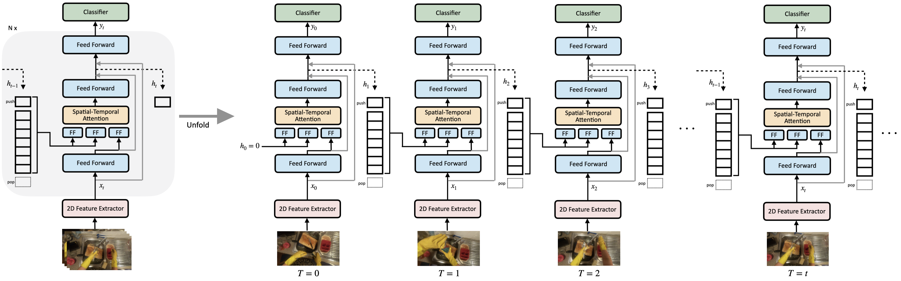
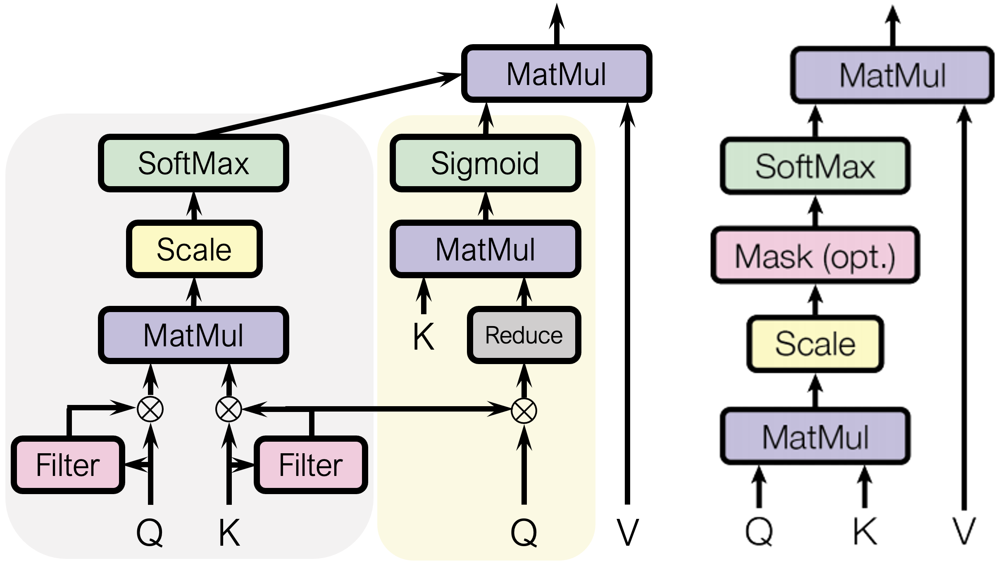

# Higher Order Recurrent Space-Time Transformer (HORST)

This is the official PyTorch implementation of [Higher Order Recurrent Space-Time Transformer](https://arxiv.org/abs/2104.08665). The complete training codes to reproduce the results will be released soon.


## HORST Overview


## Spatial-Temporal Attention
Left: Proposed Spatial-Temporal Attention. (Temporal branch is in grey area, and spatial branch is in yellow); Right: Attention in (Vaswani et al. 2017).


---

## Usage

```python
import torch
from horst import HORST

model = HORST(
    input_channels=256,
    layers_per_block=[2],
    hidden_channels=[512],
    stride=[1],
)

input = torch.randn(1, 8, 256, 56, 56) # (Batch, Timesteps, Channels, Height, Width)
out = model(input)  # (1, 8, 512, 56, 56)
```

## Citations

```bibtex
@misc{tai2021higher,
      title={Higher Order Recurrent Space-Time Transformer}, 
      author={Tsung-Ming Tai and Giuseppe Fiameni and Cheng-Kuang Lee and Oswald Lanz},
      year={2021},
      eprint={2104.08665},
      archivePrefix={arXiv},
      primaryClass={cs.CV}
}
```
